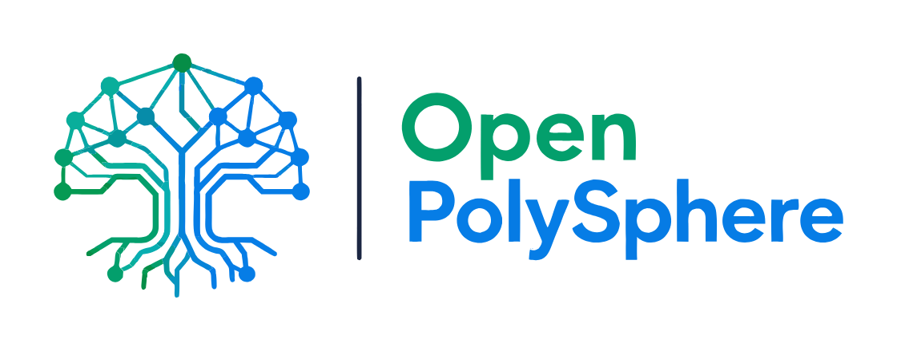

<div align="center">

[](https://github.com/org-event/OpenPolySphere)

</div>

# Realtime Call Translator

[](README.md)

Переводчик речи в реальном времени для видео- и голосовых звонков. Переводит обе стороны разговора на лету: вы говорите на своём языке, собеседник слышит на своём, и наоборот.

**Как это работает:** Аудио с микрофона проходит через распознавание речи (STT), переводится LLM, синтезируется обратно в речь (TTS) и направляется в звонок. То же самое происходит в обратную сторону для аудио собеседника.

Поддерживает **29 языков** с STT, переводом и TTS. Голосовые модели от [Piper](https://github.com/rhasspy/piper) — скачиваются прямо из веб-интерфейса.


[](https://www.bestpractices.dev/projects/13385)

> **Внимание:** macOS 14+ — основная платформа (CoreAudio, BlackHole). Linux и Windows поддерживаются: CI-сборки и локальная разработка — см. [`docs/linux.md`](docs/linux.md) и [`docs/windows.md`](docs/windows.md).

---

## Быстрый старт

```bash
git clone https://github.com/org-event/OpenPolySphere.git
cd OpenPolySphere
./scripts/bootstrap                          # dev-зависимости + git hooks (как bun install)
cargo run --release -p translator -- setup   # первый раз: скачать модели
cargo run --release -p translator            # запуск сервера
```

Откройте **http://127.0.0.1:5050** в **Google Chrome**.

Локальный режим (по умолчанию): Whisper STT + Opus-MT — API-ключи не нужны.

### После клонирования (для разработчиков)

`./scripts/bootstrap` — первая команда после `git clone`, аналог `bun install` в JS-проектах. Ставит `just`, если его нет, затем вызывает `just install`.

**Что делает `just install`:**

| Шаг | macOS | Linux / Windows |
|-----|-------|-----------------|
| Rust + rustfmt/clippy | да | да |
| Homebrew: espeak-ng, onnxruntime, bun, pre-commit | да | пропуск (см. ручную установку) |
| `bun install --frozen-lockfile` (ESLint для `web/static/js`) | да | да |
| `pre-commit install` → `just check` при коммите | да | да |

Если `just` уже установлен, можно сразу `just install` вместо `./scripts/bootstrap`.

**Команды** (из корня репозитория):

| Команда | Назначение |
|---------|------------|
| `./scripts/bootstrap` | Первичная настройка после clone |
| `just install` | То же, без установки `just` |
| `just install-linux-deps` | Одноразово: apt-пакеты (только Linux) |
| `just fetch-ort` | Скачать ONNX Runtime / подсказка по пути |
| `just check` | rustfmt, clippy, ESLint, Swift (только macOS) |
| `just check-linux-clippy` | Полный Linux clippy (нативный Linux, как в CI) |
| `just check-windows-clippy` | Полный Windows clippy (нативный Windows, как в CI) |
| `just prepush` | fmt + JS + static cfg guards (все ОС, pre-push hook) |
| `just build` | `cargo build --release -p translator` |
| `just run` | Запуск сервера |
| `just setup` | Скачать Whisper, Opus-MT и голоса Piper по умолчанию |
| `just` | Список всех рецептов |

После install: один раз `just setup`, затем `just run`. Опционально: `cp .env.example .env` для облачных API-ключей.

---

## Архитектура

Один Rust-бинарник `translator`: Axum на `:5050` + аудио-движок in-process (STT, перевод, TTS).

```
Браузер (app.js) ←SSE→ Axum ←→ audio-core ←→ CoreAudio / models
```

- **Rust** — сервер, UI API, захват/воспроизведение аудио, STT, перевод, TTS

---

## Требования

| Зависимость | Назначение | Установка |
|---|---|---|
| macOS 14+ | CoreAudio для аудио I/O | — |
| [Homebrew](https://brew.sh) | Пакетный менеджер | `/bin/bash -c "$(curl -fsSL https://raw.githubusercontent.com/Homebrew/install/HEAD/install.sh)"` |
| Rust | Приложение + аудио-движок | `brew install rustup && rustup-init` |
| espeak-ng | Фонемизация для TTS | `brew install espeak-ng` |
| ONNX Runtime | Инференс моделей | `brew install onnxruntime` |
| [BlackHole](https://existential.audio/blackhole/) | Виртуальная маршрутизация аудио | Скачать вручную |
| Xcode CLT | C-компилятор | `xcode-select --install` |

**Опционально** (облачный STT/перевод): [Deepgram](https://console.deepgram.com), [OpenRouter](https://openrouter.ai/keys)

---

## Ручная установка

Если хотите установить всё пошагово:

### 1. Системные пакеты

```bash
xcode-select --install
brew install rustup espeak-ng onnxruntime
rustup-init -y --default-toolchain stable
source ~/.cargo/env
```

### 2. Аудио-драйвер BlackHole

Скачайте и установите с [existential.audio/blackhole](https://existential.audio/blackhole/).

Нужны **оба**:
- **BlackHole 16ch** — захватывает аудио из приложения для звонков (Google Meet, Zoom и т.д.)
- **BlackHole 2ch** — отправляет переведённое аудио обратно в звонок

Настройка в приложении для звонков (Google Meet, Zoom и т.д.):
1. Откройте звонок в **Google Chrome** (не Safari)
2. Установите **BlackHole 2ch** как **микрофон** в приложении для звонков
3. Установите **BlackHole 16ch** как **динамики** в приложении для звонков

> **Важно:** НЕ используйте Multi-Output Device — это может вызвать проблемы со звуком. Устанавливайте устройства BlackHole напрямую в настройках приложения для звонков.

### 3. Голосовые модели

TTS-голоса от [Piper](https://github.com/rhasspy/piper). Скрипт установки автоматически скачивает голоса для английского и русского. Дополнительные голоса можно скачать из веб-интерфейса — выберите язык и нажмите кнопку загрузки.

Для ручной загрузки:

```bash
mkdir -p models/piper-en models/piper-ru

# Английский (по умолчанию)
curl -sL https://huggingface.co/rhasspy/piper-voices/resolve/v1.0.0/en/en_US/ryan/medium/en_US-ryan-medium.onnx \
  -o models/piper-en/en_US-ryan-medium.onnx
curl -sL https://huggingface.co/rhasspy/piper-voices/resolve/v1.0.0/en/en_US/ryan/medium/en_US-ryan-medium.onnx.json \
  -o models/piper-en/en_US-ryan-medium.onnx.json

# Русский (по умолчанию)
curl -sL https://huggingface.co/rhasspy/piper-voices/resolve/v1.0.0/ru/ru_RU/denis/medium/ru_RU-denis-medium.onnx \
  -o models/piper-ru/ru_RU-denis-medium.onnx
curl -sL https://huggingface.co/rhasspy/piper-voices/resolve/v1.0.0/ru/ru_RU/denis/medium/ru_RU-denis-medium.onnx.json \
  -o models/piper-ru/ru_RU-denis-medium.onnx.json
```

Все доступные голоса: [rhasspy.github.io/piper-samples](https://rhasspy.github.io/piper-samples/).

### 4. Переменные окружения

```bash
cp .env.example .env
```

Отредактируйте `.env`:

```
DEEPGRAM_API_KEY=ваш_ключ
OPENROUTER_API_KEY=ваш_ключ
ORT_DYLIB_PATH=/opt/homebrew/lib/libonnxruntime.dylib
```

### 5. Сборка и запуск

```bash
cargo run --release -p translator -- setup
cargo run --release -p translator
```

Откройте **http://127.0.0.1:5050** в Chrome.

---

## Возможности веб-интерфейса

- **Живой транскрипт** — баблы в стиле чата с оригиналом и переводом
- **29 языков** — переключение языковой пары в настройках, загрузка голосов в один клик
- **Выбор голоса** — несколько голосов на язык с предпрослушиванием
- **Аудио-монитор** — прослушивание переводов в браузере (только Chrome)
- **Start/Stop** — управление движком без перезапуска
- **Mute** — независимое отключение исходящего или входящего потока
- **Закладки** — отметка важных фраз, фильтр по отмеченным
- **Экспорт** — скачать полный транскрипт текстовым файлом
- **Компактный/полный вид** — переключение между подробным и компактным транскриптом
- **Метрики задержки** — для каждой фразы: STT, перевод, TTS и общая задержка
- **Тёмная/светлая тема** — переключение с сохранением

---

## Поддерживаемые языки

| Язык | STT | Перевод | TTS |
|------|-----|---------|-----|
| Английский | + | + | + |
| Арабский | + | + | + |
| Вьетнамский | + | + | + |
| Голландский | + | + | + |
| Греческий | + | + | + |
| Датский | + | + | + |
| Индонезийский | + | + | + |
| Испанский | + | + | + |
| Итальянский | + | + | + |
| Каталанский | + | + | + |
| Китайский | + | + | + |
| Корейский | + | + | — |
| Латышский | + | + | + |
| Немецкий | + | + | + |
| Норвежский | + | + | + |
| Персидский | + | + | + |
| Польский | + | + | + |
| Португальский | + | + | + |
| Румынский | + | + | + |
| Русский | + | + | + |
| Турецкий | + | + | + |
| Украинский | + | + | + |
| Венгерский | + | + | + |
| Финский | + | + | + |
| Французский | + | + | + |
| Хинди | + | + | + |
| Чешский | + | + | + |
| Шведский | + | + | + |
| Японский | + | + | — |

Для TTS нужно скачать голосовую модель Piper для языка (в один клик из веб-интерфейса). Японский и корейский поддерживают STT и перевод, но не имеют голосовой модели Piper.

---

## Решение проблем

**"Engine not starting"**
- Нажмите **Start** после загрузки страницы (сервер idle до этого)
- Локальный режим: модели в `models/` — `cargo run --release -p translator -- setup`
- Проверьте `ORT_DYLIB_PATH` → библиотека onnxruntime
- `cargo build -p translator` для проверки ошибок сборки

**"Нет аудио из звонка"**
- Убедитесь, что BlackHole 16ch настроен в Multi-Output Device
- Проверьте, что приложение для звонков использует BlackHole 2ch как микрофон

**"TTS не работает"**
- Проверьте, что установлен `espeak-ng`: `espeak-ng --version`
- Убедитесь, что файлы голосовых моделей есть в `models/piper-{lang}/`
- Скачайте голоса из Settings в веб-интерфейсе

**"Нет звука в мониторе"**
- Используйте Chrome — Safari не поддерживает маршрутизацию аудио-выхода, необходимую для монитора
- Проверьте, что системный аудио-выход установлен на динамики (не на BlackHole)

**"Ключ OpenRouter показывает invalid"**
- Нужен только при облачном переводе
- Ключи из `.env` работают, даже если поле в UI пустое

---

## Лицензия

MIT — см. [LICENSE](LICENSE). Copyright (c) 2026 Kai Letov (автор оригинала).
